# NavGrid

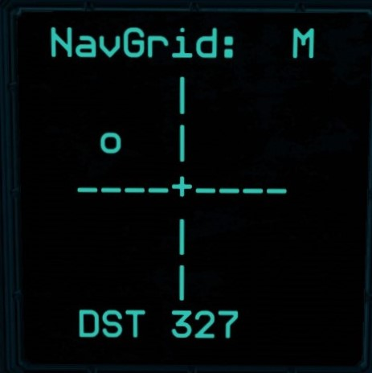

NavGrid is an all-in-one navigation system for Starbase. It builds upon Collective's ISAN2 GPS system, adding an easy-to follow visual interface that supplements ISAN's raw-numbers display.

It features 6 directional presets, up to 14 editable user-defined waypoints, and several navigational displays to help point you whichever direction you might be going.

It works while stationary and while flying at max speed.

You can set waypoints at your current location and at far off destinations.

Coordinate displays are *totally optional*. If you don't want your coordinates on display (or if you just want purely visual navigation) you can hide all related displays on a memory chip with no loss in functionality.

Best of all, it is fully compatible with most other projects that use ISAN, as long as they are compatible with ISAN's `speed` setting.

**If you want to take NavGrid for a test drive *right now*, download and import my <a href=blueprints/NavGridDemoShip.fbe download>NavGrid Demo Ship</a> for a fully functional QUAD setup.**

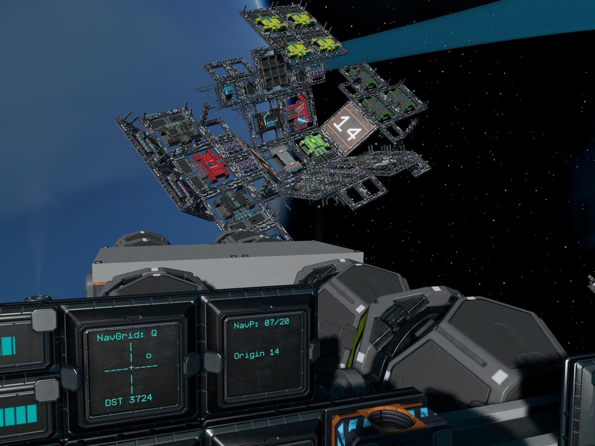

# Table of contents
- [Features and Options](#features)
- [Getting Started](#gettingstarted)
- [Controls](#controls)
- [Manual Installation](#install)

# Features and Options

**Performance:** *0.8s* refresh time with max *3.0s* processing latency.

**Core:**

- NavGrid display: visual ASCII display for easy directional navigation.
- 6 Directional presets for general navigation (2 for each x, y, z axis).
- 10 user-defined waypoints.
- ISAN MONO.
- Triplicate ISAN synchronization: 3 individual ISAN units operate on separate
synchronized chips to provide maximum accuracy with zero performance loss.
- Full support for any other ISAN addons you might be using, as long as they
are compatible with ISAN's `speed` option.

**(Optional) QUAD:**

+ Improved response while turning.
+ QUAD damage detection: QUAD mode has the same automatic damage detection as
standard ISAN, with all three units entering MONO in unison if any nonessential receivers are
damaged or destroyed.

**(Optional) Expansion module:**

+ 4 more user-defined waypoints.
+ Display navpoint coordinates and ship attitude.

**(Optional) Use your own waypoint system:**

+ Replace NavGrid's navpoint management with your favorite waypoint system, as
long as it uses ISAN coordinates.
+ Refer to the [euler_waypoint.yolol](optional/custom_waypoints/euler_waypoint.yolol) source code and the chip diagram in [Manual Installation](#install) for instructions.

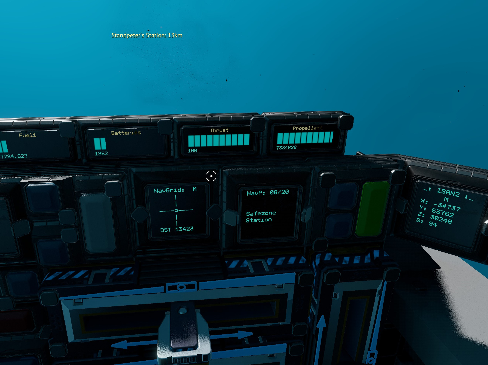

# Getting Started

### **1 - Remove your ISAN chip**

Don't worry: NavGrid includes [another one](required/isan.yolol).

If you are unfamiliar with ISAN, please refer to the [ISAN manual](isan.to/doc) for a really good explanation of how all this works.

### **2 - Download the <a href=blueprints/NavGridV1-0.fbe download>NavGrid V1.0</a> blueprint and import it into your SSC.**

[This reddit post](https://www.reddit.com/r/starbase/comments/p49nc1/tutorial_how_to_share_selfmade_blueprints_with/) has good directions for importing blueprints.

### **3 - Load the NavGrid blueprint and delete any modules you don't want.**

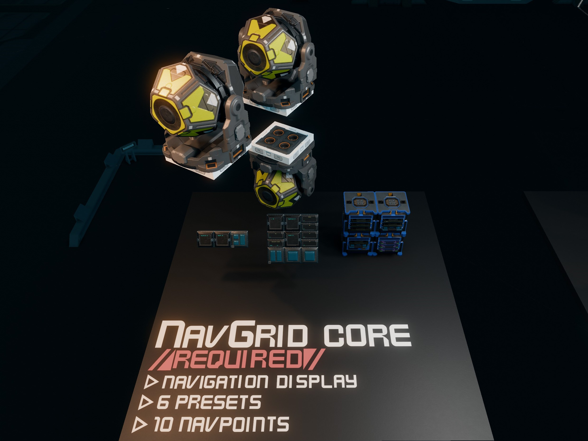 |  | 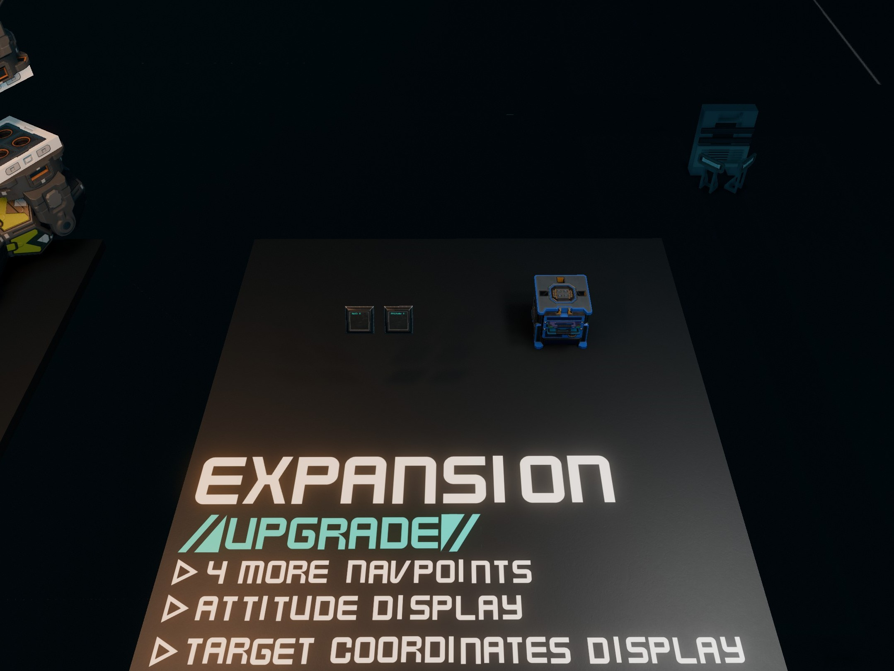

*My recommendation:* Use Core + the Expansion, but not QUAD. MONO requires a little more patience (just like regular ISAN) but it is sufficient for 90% of situations.

- If you are adding NavGrid to a ship in the SSC, select everything that's left and save as a submodule so you can import it into other blueprints.
- If you are adding NavGrid outside the SSC, just buy the "ship". (Make sure there's nothing else in your hangar first or things will go flying)

### **4 - Add the included receivers to your ship**
(IMPORTANT: If you are using QUAD, use those receivers *instead* of the receivers in core.)

This is the complicated step. You'll notice my receivers are in a specific formation:

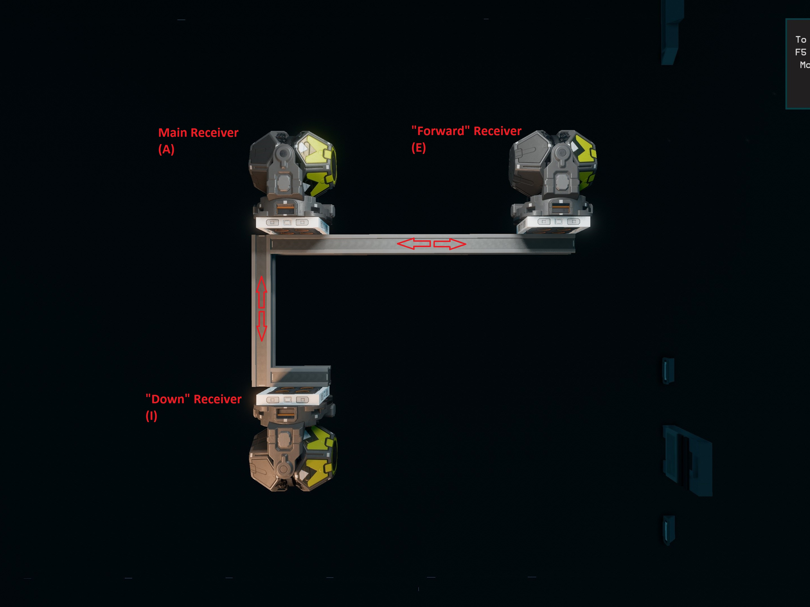

NavGrid has three ISAN units: a main ISAN unit for getting coordinates, a `forward` ISAN unit for figuring out where you're pointed, and a `down` ISAN unit for figuring out your roll.

For NavGrid to be accurate, it is very important that all three units form an `L` with `forward` being forward and `down` being down, kind of like your flight control unit. Distance between the units does not matter much; units that are far apart help reduce jitter while flying, but NavGrid works even if the Receivers are right next to each other. *All that really matters is that they are in line with each other as shown above - that is **very** important.*

Once installed, make sure that your main receiver has a field named `a`, your forward receiver has a field named `e`, and your down receiver has a field named `i`.

**Additional information for QUAD ISAN:** 

Pretend that each group of four is a single unit; try not to mix them up or move them out of formation when you install them.

The main ISAN receivers" have variables named A, B, C, and D. Receiver A has `SignalStrength` renamed to `a` and `TargetMessage` renamed to `at`. B has `b` and `bt` and so on.

Following that pattern, the "forward" and "down" receivers continue the alphabet from there:
- Forward: E, F, G, and H
- Down: I, J, K, and L

For maximum accuracy, each grouping of A/E/I, B/F/J, C/G/K, and D/H/L should form their own `L` shape as shown below. The recievers included in the blueprint are in the correct formation but you should always double-check after installation.

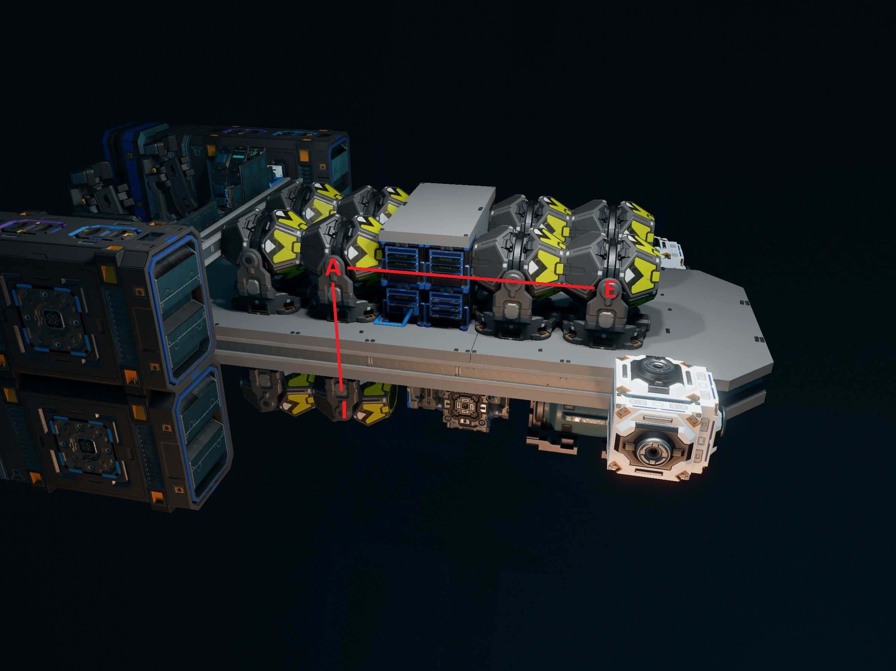 | 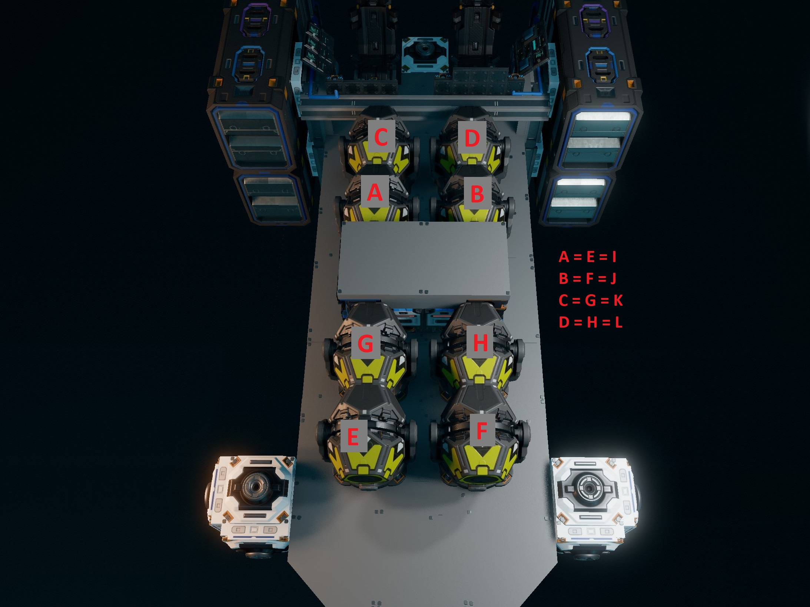

### **5 - Add all chip racks and displays**

Almost done! All you need to do now is attach the included racks and displays wherever works best for you.

The big 3x3 display is best used while not actively flying, so it doesn't need to be in the cockpit.

### **6 - Take it for a spin!**

Once everything is installed, the NavGrid display should not be displaying any warnings if ISAN is working correctly. Try restarting ISAN if there are any errors. 

If "Receiver Error" pops up it means you are out of ISAN range or one or more recievers can't be found. Check your receiver cables and try renaming their fields again.

Once NavGrid is displaying its crosshair, set your waypoint to 4 and follow the dot. If your receivers are properly aligned, you should end up pointed at Eos with :Pit near 0 and :Hdg near +/-180

# Controls

### **Selecting navpoints:**
Press nUp or nDn to change the navpoint index.

### **Set current navpoint to the current coordinates:**
Press nSet. Press again to overwrite if a waypoint already exists at this index. Presets cannot be overwritten.

### **Edit navpoint or set navpoint from coordinates:**
Using the universal tool on the included displays, edit nName, nX, nY, and/or nZ as desired. Press nSave. Press again to overwrite. Presets cannot be edited.

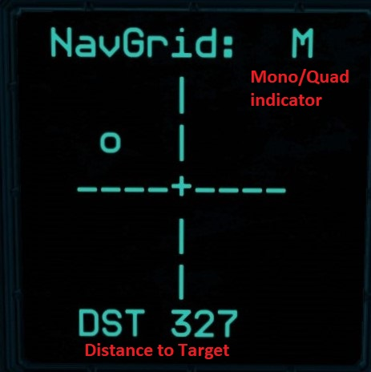 | 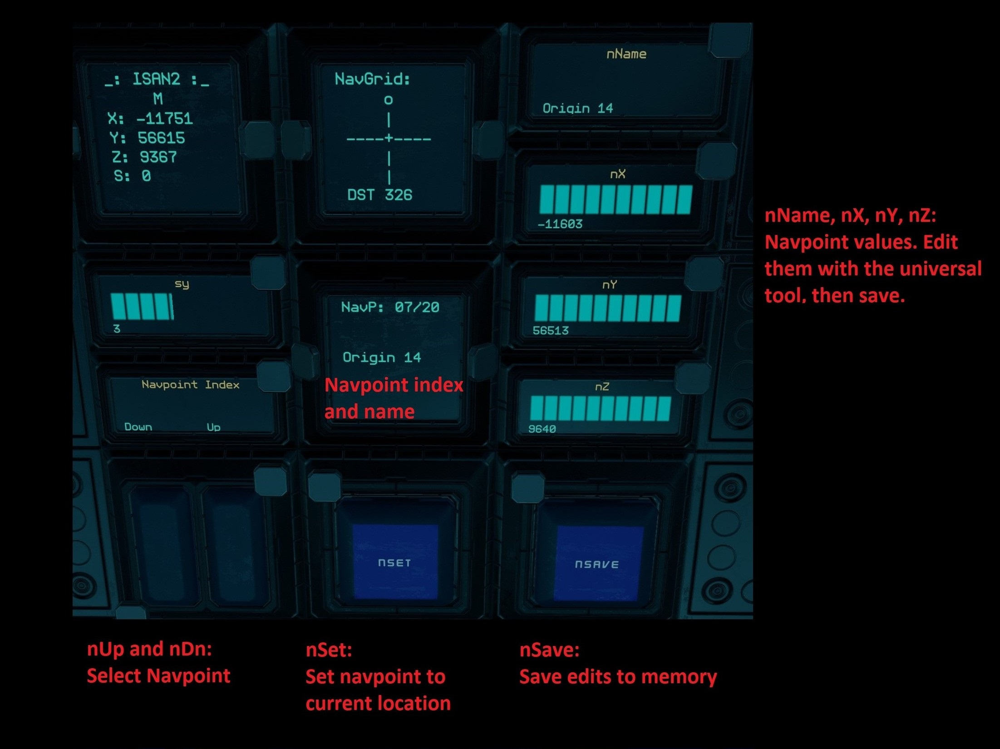

# Manual Installation

I highly recommend the blueprint-based installation in the [Getting Started](#gettingstarted) section. Copying multiple scripts by hand is much more tedius and error-prone.

If you're still here then I'll assume you know your way around a yolol chip:

1) Copy all `required` chips and any desired `optional` chips.
    - The source files in git have full documentation complete with usage, required controls (if any), and additional installation directions. Chip installation is pretty simple compared to receiver installation, but if you don't read the docstrings you'll probably miss something!
2) Set up your receivers in the `L` formation shown in the [Getting Started](#gettingstarted) section.
    - Make sure each receiver has `SignalStrength` and `TargetMessage` renamed to the correct names, as shown in that section.

My core chips are arranged as follows, in case you want to pull chips from the blueprint instead of copying:
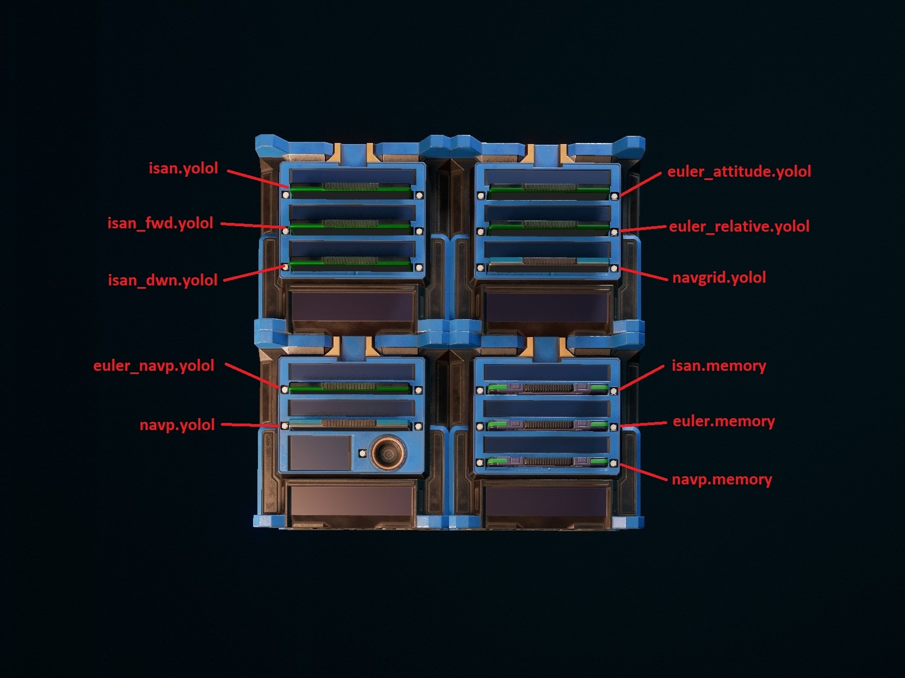
